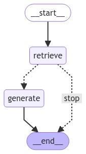
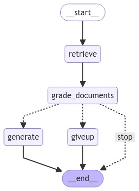
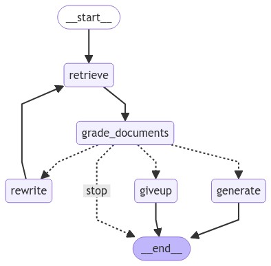

# FreshmanRAG_bot
Ukrainian Telegram bot assistant for freshmen based on RAG with LLM.

Very often, first-year students have a lot of questions. But, unfortunately, they flatly refuse to read the pinned messages and guides. This forces us, those who help them, to answer the same questions many times. This bot aims to make the life of volunteers easier by independently providing answers or relevant links to common questions.

## Bot functionality

### Commands
There are two categories of bot commands: user commands and admin commands. Admin commands enable actions such as banning users, adding information, or publishing links to the knowledge base. These commands are found in the management handlers. User commands are intended for the bot’s users (freshmen) and include the following:
+ **/docs \<query\>** - return documents/facts relevant to the query
+ **/docs_rep** - return documents/facts relevant to the query from a replied message
+ **/ans \<question\>** - answer a question using RAG
+ **/ans_rep** - answer a question from a replied message using RAG
+ **/help** - show user's commands description
+ **/start** - show welcome message

### RAG pipeline types
Currently 3 different RAG pipelines are implemented. By default the bot uses the *Conditional RAG with question rewriting* pipeline, but you can change in the [configs](#configuration).

All pipelines support the ability to return only documents relevant to a question without LLM answer generation, it is implemented as a conditional edge which is depicted as `stop` on all diagrams below.

#### Simple RAG
The `Simple RAG` pipeline that uses the provided [retriever](#retrievers) to find the relevant documents from the knowledge base and then optionally use this information for generation.



#### Conditional RAG with document filtering
The `Conditional RAG with document filtering` pipeline adds an extra step to the `Simple RAG` that aims to filter out all documents irrelevant to a question. If all documents have been filtered out the pipeline generates a message (`giveup` node) that there is no relevant document in the knowledge base.



#### Conditional RAG with question rewriting
The `Conditional RAG with document filtering pipeline` doesn’t give up immediately. Instead, it attempts to rephrase the question (up to a specified number of times) and uses the rewritten query for document search and question answering.



## LLMs
This bot is currently using Gemma2-2B-it (Q5-K quantized) as an LLM. This is due to the fact that I do not have the money to host large models, let alone one on nodes with GPU. At the same time, even the smallest LLaMa-3.1-8b quantised into 4 bits takes 1 minute to run with llama.cpp. So I decided to use the new Gemma2-2B-it, which, according to the authors, is the best model in this size, and most importantly, more or less understands Ukrainian.

If I have time, I plan to fine-tune Gemma2-2B-it for better understanding of Ukrainian (including expanding the tokenizer dictionary) and especially for RAG. You will find corresponding training script in the `llms` directory.

## Retrievers
By default we use dense vector retriever with Sentence-BERT model [*lang-uk/ukr-paraphrase-multilingual-mpnet-base*](https://huggingface.co/lang-uk/ukr-paraphrase-multilingual-mpnet-base) to extract embeddings and `pgvector` as a vector store.

## Configuration
To configure the bot I use reliable and flexible tool called Hydra. In the [configs](./configs/) directory you can find and add your own configs. Please read the [docs](https://hydra.cc/docs/1.3/intro/) to properly to do it. By default (and especially inside docker container) bot load default config, so one has to not just add new configurations but also appropriately change [default.yaml](./configs/default.yaml).

## How to deploy
The easiest way to deploy the bot is to:
1. Clone the repository
```
git clone git@github.com:ShkalikovOleh/FreshmanRAG_bot.git
```
2. Load all desired models (please use scripts from [init_scripts](./init_scripts/)) into the `.models` directory and optionally place your own configs in the `configs` directory.
3. Place `.env` file with your api keys and other variables (as in the example.env) in the repo directory
4. Run with docker-compose
```
docker compose up -d
```